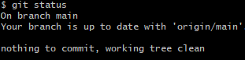
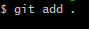
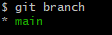
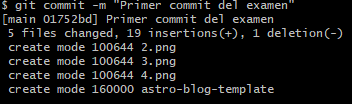
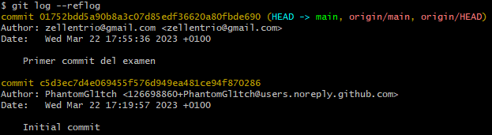
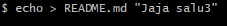
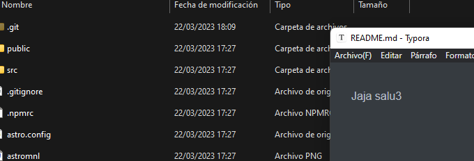
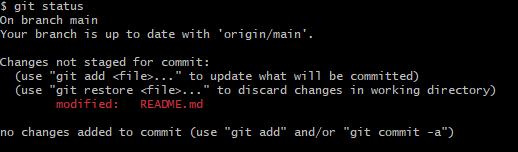

# examenGitEj2

<ul>
    <li>Descarga el siguiente proyecto: xxxxxx, y activa el control de versiones de forma local en la carpeta correspondiente.	</li>
    

        git clone [enlace] >> git cd astro-blog-template >> git init
    

    <li>Descarga el siguiente proyecto: xxxxxx, y activa el control de versiones de forma local en la carpeta correspondiente.</li>
    
<li>Añade todos los archivos del repo a seguimiento</li>
    
<li>Comprueba cuantas ramas tiene el repositorio y en cual te encuentras</li>
    
<li>Realizar un commit de los últimos cambios con el mensaje “Primer commit del examen” y ver el estado del repositorio.</li>
    
<li>Lista todos los commits que has realizado</li>
    "Innitial commit" | "Primer commit del examen"  
    
<li>Realiza un cambio en alguno de los archivos del proyecto</li>
     
    
<li>Combrueba el estado del repo</li>
    
<li>Realiza un commit con tu nombre y apellidos</li>
    git commit -m "Juan Jose Lozano Martinez"
    git push
<li>Crea dos ramas diferentes</li>
    git branch dev1
    git branch dev2
<li>Muevete a dev1</li>
    git checkout dev1
<li>Muevete a dev2</li>
    git checkout dev2

</ul>

​    

